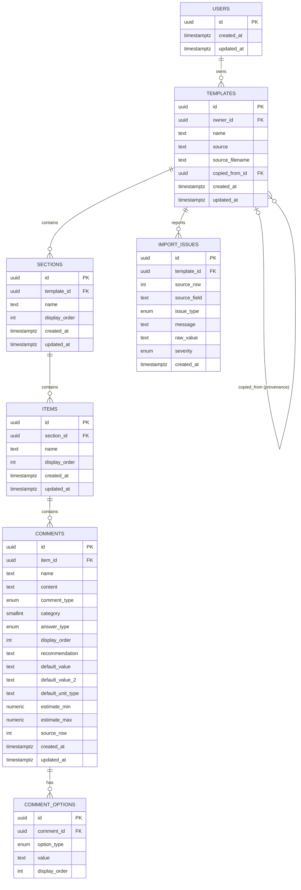

# Database & Domain Design — Hive Inspect Template Importer

Authoritative design for the PostgreSQL schema and the domain/protocol boundary. Implements
the assignment's *schema/database foundation* step only.

- Migrations: `database/migrations/0001_create_template_schema.sql`,
  `database/migrations/0002_rls_policies.sql`,
  `database/migrations/0003_rls_enforcement.sql`
- Seed: `database/seed/dev_auth.sql`
- Domain/protocol code: `backend/app/domain/`, `backend/app/protocols/`

> **Validation status:** migrations and RLS were validated statically (PostgreSQL grammar
> parse via `pglast`) and then executed against a live local PostgreSQL instance: schema,
> FKs, cascades, triggers, seeds, and RLS cross-user checks are exercised by the harness in
> `database/tests` (`make db-test`), which runs in CI; see §17. `0003` was additionally
> applied to the live Supabase project and verified there: the owning user still reads its
> own rows, an unrelated user reads zero rows across all five user-owned tables, and a
> cross-tenant `INSERT` is rejected by `WITH CHECK`.

---

## 1. Domain model (ER diagram)

### 1.1 Hierarchy

```
auth.users (Supabase, production)
    |                    1:1 mirror on signup (public.users = identity anchor)
    v
users                    -- id == auth.users.id; no credentials, no profile fields
    |
    | 1:N
    v
templates                -- ordered by created_at/updated_at; duplicated templates keep
    |                      copied_from_id for provenance only; all child IDs are new
    | 1:N
    v
sections
    | 1:N
    v
items
    | 1:N
    v
comments
    | 1:N
    v
comment_options

templates                -- import diagnostics hang off the template they were reported for
    | 1:N
    v
import_issues
```

### 1.2 Mermaid (same model, machine-readable)



---

## 2. Table purposes

| Table | Purpose |
| --- | --- |
| `users` | **Identity anchor only.** `id` equals `auth.users.id` (production) or the seeded deterministic dev id (local dev). No credentials, no profile fields, no auth logic — this is NOT a `profiles` table. It exists so `templates.owner_id` has a real foreign-key target with identical integrity in Supabase and local development. |
| `templates` | One complete inspection template, the aggregate root. Holds provenance (importer `source`, `source_filename`, `copied_from_id`). |
| `sections` | Ordered named groups inside one template. |
| `items` | Ordered checklist items inside one section. |
| `comments` | Checklist rows: name, free-form `content`, Spectora flags (type/answer/category), defaults, estimates, and `display_order`. |
| `comment_options` | Normalized option values for a comment, discriminated by `option_type` (`multiple_choice` | `unit_type`). One table covers both Spectora option columns without extra tables. |
| `import_issues` | Persistent, user-visible diagnostics from an import (missing/unsupported/invalid content). Not a logging table. |

---

## 3. Columns and types

Every table uses `uuid` primary keys (`gen_random_uuid()` / supplied), `timestamptz`
`created_at`/`updated_at` where mutable, and an integer zero-based `display_order` on
ordered children. Literal SQL lives in the migrations; the key choices:

**users** — `id uuid PK`, `created_at`, `updated_at`.

**templates** — `id uuid PK`, `owner_id uuid NOT NULL FK→users`, `name text NOT NULL`,
`source text NOT NULL` (importer brand, e.g. `spectora`; intentionally unconstrained so
future importers fit), `source_filename text`, `copied_from_id uuid NULL FK→templates`
(provenance only), timestamps.

**sections** — `id`, `template_id uuid NOT NULL FK→templates`, `name text NOT NULL`,
`display_order int NOT NULL CHECK(>=0)`, `UNIQUE(template_id, display_order)`, timestamps.

**items** — same shape under `section_id`, `UNIQUE(section_id, display_order)`.

**comments** — `id`, `item_id uuid NOT NULL FK→items`, `name text NOT NULL`, `content text
NOT NULL DEFAULT ''` (free-form; markup decoded during import, never one opaque template
blob), `comment_type` enum (`info|limit|defect`), `category smallint CHECK(IN(-1,0,1))`,
`answer_type` enum (`boolean|checkbox|date|number|range|text`), `display_order int NOT NULL
CHECK(>=0)`, `recommendation text`, `default_value text`, `default_value_2 text`,
`default_unit_type text`, `estimate_min/estimate_max numeric(12,2)`, `source_row int`
(spreadsheet row for provenance/correlation), timestamps.

**comment_options** — `id`, `comment_id uuid NOT NULL FK→comments`, `option_type` enum,
`value text NOT NULL`, `display_order int NOT NULL CHECK(>=0)`,
`UNIQUE(comment_id, option_type, display_order)`.

**import_issues** — `id`, `template_id uuid NOT NULL FK→templates`,
`source_row int`, `source_field text`, `issue_type` enum
(`SOURCE_DATA_MISSING|UNSUPPORTED_CONTENT|INVALID_SOURCE_DATA`), `message text NOT NULL`,
`raw_value text`, `severity` enum (`info|warning|error`, default `warning`), `created_at`.

**ID strategy:** UUIDs everywhere. They are externally exposed (template/section/... ids
round-trip through the API), avoid guessable enumeration (a layer of IDOR defense), and are
safe to generate application-side when batching inserts for imports/duplication.

---

## 4. Relationships

| Relationship | Cardinality | FK | ON DELETE |
| --- | --- | --- | --- |
| `users` → `templates` | 1:N | `templates.owner_id → users(id)` | **CASCADE** (deleting a user removes their templates; no orphaned ownership) |
| `templates` → `sections` | 1:N | `sections.template_id → templates(id)` | **CASCADE** |
| `sections` → `items` | 1:N | `items.section_id → sections(id)` | **CASCADE** |
| `items` → `comments` | 1:N | `comments.item_id → items(id)` | **CASCADE** |
| `comments` → `comment_options` | 1:N | `comment_options.comment_id → comments(id)` | **CASCADE** |
| `templates` → `import_issues` | 1:N | `import_issues.template_id → templates(id)` | **CASCADE** (issues belong to one import run) |
| `templates` → `templates` | 0..1:N | `templates.copied_from_id → templates(id)` | **SET NULL** (deleting an original must not break or block deleting its copies) |

Cascades are deliberate: a child record has no meaning outside its parent, and the parent
tree is the unit of load/edit/delete. The single non-cascade (`copied_from_id`) is
provenance only and never dereferenced for data access.

---

## 5. Ownership model

- **Who owns what.** Every template has exactly one `templates.owner_id`, which is an
  authenticated user id (`auth.users.id`). Ownership is never duplicated onto child rows;
  a child belongs to a user iff its parent template's `owner_id` is that user.
- **How identity reaches the app.** A single `AuthenticationProvider` boundary resolves the
  request into a domain `UserContext` (`backend/app/domain/models/user.py`). The
  application never sees tokens, sessions, or SDK objects — only `UserContext.user_id`,
  which becomes `owner_id` in repository calls.
- **Production.** `SupabaseAuthProvider` (stub, `app/adapters/authentication/supabase.py`)
  validates the Supabase access token and returns the same `UserContext`. Wired in the
  auth/API step; fails closed until then.
- **Development.** `DevAuthProvider` (`app/adapters/authentication/dev.py`) derives the
  identity from the credential: a `DEV_AUTH_USERS` entry (default `demo@hive.test` →
  `00000000-0000-0000-0000-000000000001`, the row seeded by `database/seed/dev_auth.sql`), a
  real JWT's `sub`, or a stable per-credential id. A derived identity's `users` row is
  created on first request (`ensure_user_row`), because nothing mirrors a synthesised
  identity the way `on_auth_user_created` mirrors a real signup — without it every write
  would fail the `templates.owner_id` foreign key. Two different credentials are therefore
  two different tenants, rather than everyone sharing the seeded demo user.
- **Enforcement (two layers).**
  1. **Application/backend (primary).** The backend scopes every query by
     `owner_id = current UserContext.user_id`. The repository protocol
     (`TemplateRepository`) *receives* `owner_id` on every operation so no path can omit it.
  2. **RLS (defense in depth).** On Supabase, `auth.uid()`-keyed policies (§6) bind every
     statement, so even direct access is scoped. RLS is **never disabled** for the
     development stub: the stub's repository calls go through the same app-layer `owner_id`
     scoping, and they additionally run under the RLS-enforcing role described below.
- **How RLS is made to bind (`0003`).** A table owner is exempt from its own row-level
  security, so policies cannot attach to a connection that owns the tables. The request path
  therefore does not run as the owner: each request opens a transaction, assumes the
  non-owner `hive_app` role (`SET LOCAL ROLE`) and publishes the verified user's claims
  (`set_config('request.jwt.claims', …, true)`), which is what `auth.uid()` reads. Both are
  transaction-scoped, so a pooled connection cannot carry one user's identity into the next
  request. The role is `NOLOGIN` (assumed only via `SET ROLE`, no password, no direct
  connection) and `NOBYPASSRLS`. Only migrations and administrative work use the owner role.
  Set `DB_APP_ROLE=` (empty) to disable this, which is only correct on plain PostgreSQL where
  `0002` is a no-op anyway.
- **No custom auth.** No password tables, no token storage; Supabase Auth owns
  authentication, our schema only records the resulting identity.

---

## 6. Row Level Security strategy

Applied in `0002_rls_policies.sql`, guarded so it only activates on Supabase (where the
`auth` schema exists) and is a no-op on plain local/CI PostgreSQL.

- **Strategy B — parent ownership through EXISTS subqueries.** `owner_id` lives only on
  `templates`. Child policies prove ownership by walking the parent chain
  (`section→template`, `item→section→template`, …). No owner duplication, so there is no
  way for child rows to disagree with their template's owner, and no UPDATE can move a row
  under another owner without the `WITH CHECK` failing.
- **Policies.** One `_all` policy per table (covers SELECT/INSERT/UPDATE/DELETE), each with
  `USING` + `WITH CHECK`:
  - `users_self`: `id = auth.uid()`.
  - `templates_owner_all`: `owner_id = auth.uid()`.
  - `sections/items/comments/comment_options/import_issues_owner_all`: `EXISTS(...parent
    chain… t.owner_id = auth.uid())`.
- **INSERT safety.** `WITH CHECK` refuses a new section/item/comment/option/issue whose
  parent chain does not terminate at a template owned by `auth.uid()` — a user cannot attach
  children under another user's template.
- **UPDATE safety.** `USING` gates which rows can be updated; `WITH CHECK` prevents
  re-pointing a row's `*_id` to a template/section/item the user does not own.
- **DELETE safety.** `USING` restricts deletes to rows owned transitively by the actor.
- **Privileged roles.** The table owner and `supabase_service_role` bypass RLS, and are used
  only for migrations and administration. They are **not** the request path: the backend's
  repository transactions assume `hive_app` (§5), so a query that forgot its `owner_id`
  predicate would return nothing rather than another user's rows. This is why the repository
  contract threads `owner_id` explicitly — the predicates stay the readable, testable
  expression of the rule, and RLS is the wall behind them.

---

## 7. Index strategy

| Index / constraint | Supports | Why | Write cost |
| --- | --- | --- | --- |
| `templates_owner_id_idx` | list user's templates; FK lookups on delete | without it every `WHERE owner_id = ?` is a seq scan; the FK alone does not index `owner_id` in Postgres | one row inserted/updated per template; also later per ordering of `list_for_user`, `(owner_id, updated_at)` can replace this if the write profile allows — decided against today to keep one index |
| `UNIQUE(template_id, display_order)` on sections | ordered load + reordering + FK-side delete | serves ordered child reads and prevents ambiguous order; doubles as the FK index Postgres would need | one row per section |
| `UNIQUE(section_id, display_order)` on items | same for items | same | one row per item |
| `comments_item_order_idx (item_id, display_order)` | ordered comment load per item | **plain** (not UNIQUE): unlike sections/items, comment order comes from source data which could theoretically repeat; an explicit order column exists precisely so we never rely on insertion order | one row per comment |
| `UNIQUE(comment_id, option_type, display_order)` on comment_options | option load per comment, dedupe | also the FK index | one row per option |
| `import_issues_template_id_idx` | issues for a template | ordered scan of issues per import; FK-side delete | proportional to issues |

Deliberately **not** created: redundant `(template_id)` indexes on
sections/items/comments/options (their ordering UNIQUEs already lead with the FK column),
`comments(item_id)` (covered by the leftmost prefix), a `sections(id)` index (PK), and any
owner-side `(owner_id, …)` composites that do not match a real query yet.

---

## 8. Query strategy

Ten patterns the repository contract maps to (§12 lists SQL). All queries are
**parameterized**; no string-concatenated SQL anywhere. N+1 is avoided: hierarchy load is
a fixed, small set of batched queries, and the per-`JSON` aggregate alternative was
considered (§8.3).

1. List current user's templates — `SELECT … FROM templates WHERE owner_id = $1 ORDER BY updated_at DESC`.
2. Get one template owned by user — single row scoped by `owner_id`.
3. Full hierarchy — **4 batched, ordered queries** (see below).
4. Import issues for a template — by `template_id` (+ implied ownership), newest first.
5-7. Renames/content edits — single `UPDATE … WHERE id = $n AND parent-chain-owned` (or via
   the scoped template id), relying on the PK index.
8. Duplicate template — one transaction, `copied_from_id` set, fresh UUIDs (§12.8).
9. Delete template — one transaction; FK cascades remove descendants.
10. Ownership isolation — every statement carries the owner predicate; verified in §16.

### 8.1 Hierarchy load (chosen approach)

At this scale (13 sections / 61 items / 392 comments / ~90 option rows for the real
template), the most **maintainable and type-safe** approach is a small number of batched
queries assembled in the repository/application:

```
1. template row
2. sections            WHERE template_id = $1 ORDER BY display_order
3. items               WHERE section_id IN ($2…$n) ORDER BY section_id, display_order
4. comments            WHERE item_id IN ($3…$n) ORDER BY item_id, display_order
5. options             WHERE comment_id IN ($4…$n) ORDER BY comment_id, display_order
```

Each is covered by an index, each returns rows in `display_order`, and the app groups them
into the aggregate. Comments carry `id` as a deterministic tiebreaker because the source
may theoretically repeat an order value (see §11). Worst-case round trips: **5** (constant,
not per-child).

### 8.2 Why not one `json_agg` mega-query?

A single recursive/lateral `jsonb` aggregate is possible and would also return the whole
tree in one round trip, but it trades simplicity, SQLAlchemy type-safety, and readability
for latency that is already sub-millisecond at this data size. Chosen: batched queries.
Revisit only if template size becomes pathological.

### 8.3 Why not query-per-child?

That would be N+1 (`sections + Σ items + Σ comments + Σ options` round trips). Rejected.

---

## 9. Caching decision

**No external cache (no Redis/Memcached).** The source of truth is PostgreSQL; the expected
workload is modest (a handful of templates per user, ~600 rows each max). Hot-path reads
(full hierarchy ≈ 5 indexed queries) are the only repeated work, and they are already
cheap.

If application-level caching is ever added, it must be *per-owner*, e.g. key
`template:{owner_id}:{template_id}` (never `template:{template_id}` alone), with:
TTL short (e.g. minutes); invalidation on every write, duplication, and deletion,
including child edits; documented stale behavior (serve stale ≤ TTL then refetch); and the
rule that a cache hit still never bypasses RLS/authorization because the key is
owner-scoped and the DB remains authoritative. Today none of this infrastructure exists,
which is the correct amount.

---

## 10. Import issue strategy

`import_issues` persists problems the importer noticed so nothing vanishes silently. Issue
types are exactly the three the assignment cares about — no larger taxonomy:

- `SOURCE_DATA_MISSING` — the export did **not** provide the information.
  Example for this sample: 11 rows have no `Comment Name` → issue on that row.
- `UNSUPPORTED_CONTENT` — the export **contains** information the app cannot represent.
  Example: any future row populating `Default Location`, `Locked`, `Simple Format`,
  `Disable Photos`, or a Default Photo field → issue carrying the raw value.
- `INVALID_SOURCE_DATA` — malformed source (e.g. an unparseable number or an unknown
  `Comment Type`). Optional third category, used only when actually encountered.

Every row records `template_id`, optional `source_row`/`source_field`, `message`,
`raw_value`, `severity`, and `created_at`. The domain model mirrors this
(`ImportIssue`), and issue rows come down with the template — queries that "forget"
something find it in the issue list instead of losing it.

---

## 11. Ordering strategy

- **Convention: zero-based, explicit `display_order` at every level**, with
  `CHECK (display_order >= 0)`:
  `sections.display_order`, `items.display_order`, `comments.display_order`,
  `comment_options.display_order`.
- **Why zero-based:** the source's own `Order (w/i item)` uses 0-based values, so storing
  source values verbatim stays consistent; enumeration also starts at 0.
- **Never relies on insertion order.** Rows are always read `ORDER BY … display_order`, and
  section/item/option uniqueness constraints codify order. `comments.display_order` is a
  plain (non-unique) value because the source may in principle repeat an order; therefore
  comment retrieval always orders by `(item_id, display_order, id)` — the unique `id` makes
  the result deterministic even on ties.
- **This export has no order data** (`Order (w/i item)` is empty in all 392 rows), so the
  importer assigns `display_order` = 0-based index of first appearance (rows appear in
  template order). If a future export populates the order column, the importer stores those
  values verbatim — the schema accepts either.
- Reordering (a future editor) is a simple value swap; duplication copies `display_order`
  unchanged.

---

## 12. Duplication strategy

Duplication is a transactional, ownership-scoped, deep copy in the repository
(`TemplateRepository.duplicate`). All ids are **new**; nothing is shared:

```
Original Template            Duplicated Template
├── Section A (old id)  →    ├── Section A (new id)
│    └── Item A (old)   →    │    └── Item A (new id)
│         └── Comment   →    │         └── Comment (new id + new option ids)
└── …
```

- Every `owner_id`, `display_order`, and content field is copied; FK values are remapped to
  the copy's new ids.
- The copy's `copied_from_id` = source template id (**provenance only**; `ON DELETE SET
  NULL` means deleting the original never breaks copies).
- Import issues are **not** copied (they describe a specific import of the original).
- Because no mutable child row is ever referenced by both templates, editing the copy can
  never mutate the original — cross-template mutation is structurally impossible, not just
  discouraged. RLS `WITH CHECK` further prevents re-pointing children across templates.

---

## 13. Delete / cascade behavior

See the FK table in §4. Summary of decisions:

- Descendants of a template cascade (`sections → items → comments → options`) — they have no
  existence outside the tree; deleting a template deletes its tree in one statement.
- `users → templates` cascades: deleting an identity removes its templates (no orphans).
- `copied_from_id → templates` is `SET NULL`: deleting an original keeps its copies valid.
- `import_issues` cascades with its template — issues are per-import diagnostics.
- No orphan paths exist: all child FKs are `NOT NULL` and every parent is reachable.

---

## 14. Authentication boundary

See §5. Boundary contracts in code:

- Protocol: `app/protocols/authentication.py` →
  `AuthenticationProvider.get_current_user(token: str) -> UserContext`. The API layer
  strips the `Bearer` scheme and hands every provider the raw token; the provider attests
  the identity. The development stub ignores the value; the production provider validates
  it against Supabase Auth.
- Domain: `app/domain/models/user.py` → `UserContext(user_id, provider, email=None)`.
- Production adapter: `app/adapters/authentication/supabase.py` → HS256 verification of
  the Supabase access token with `SUPABASE_JWT_SECRET`; requires `aud` **and** `role` to
  be `authenticated` (rejects `anon`/`service_role` API keys), `sub` a UUID (→
  `UserContext.user_id`), and `exp`/signature valid; optional `iss` check from
  `SUPABASE_URL`. Fails closed when the secret is not configured. Activated when
  `APP_ENV=production`.
- Development adapter: `app/adapters/authentication/dev.py` → deterministic
  `00000000-0000-0000-0000-000000000001` (header required, value ignored).
- Repository boundary: `app/protocols/repositories/template_repository.py` — every method
  takes `owner_id`, so application services cannot omit authorization anywhere.
- Import-issue access is folded into `TemplateRepository.list_import_issues` (one small
  method, no separate interface — avoids an abstraction with a single consumer).

The application layer cannot distinguish the providers: same protocol, same `UserContext`,
same `owner_id` semantics.

---

## 15. Migration strategy

- Plain, ordered, versioned SQL applied **once to an empty database**
  (`0001_…`, `0002_…`), no migration tool dependency. This matches the repo's convention
  (see `database/migrations/README.md`).
- Run locally or on Supabase with `psql "$DATABASE_URL" -f …` in order; our CI runs the
  same loop.
- Deterministic: fresh database → identical schema every time. Live databases are never
  hand-edited; schema drift is future migrations.
- Supabase-only constructs (auth sync trigger, RLS) are inside `DO` blocks guarded by an
  `auth`-schema check, so every file is valid on plain local/CI PostgreSQL as well.
- Requires PostgreSQL ≥ 13 (built-in `gen_random_uuid()`).
- Seed `dev_auth.sql` is development-only identity, clearly labeled; production rows arrive
  via the `on_auth_user_created` trigger.

---

## 16. Spectora field mapping (actual export, `sample-data/sheet1.xml`)

Measured facts from the committed export (42 columns `A1:AP1`, rows 2–393, **392 comments**;
**13 sections**, **61 items** by first-seen order; comment rows carry NO explicit order):

| Col | Export field | Measured (392 rows) | Classification | → Schema |
| --- | --- | --- | --- | --- |
| A | Section Name | 392/392 (13 distinct) | Required structured | `sections.name`; `display_order` = first-seen index |
| B | Item Name | 392/392 (61 distinct) | Required structured | `items.name`; `display_order` = first-seen index |
| C | Comment Name | 381/392 | Required structured | `comments.name` (may be empty string) |
| D | Comment Text | 91/392; 34 contain XML-escaped markup; longest 701 chars | Required structured | `comments.content` (TEXT; entities decoded) |
| E | Comment Type (info, limit, defect) | 392/392: defect 302 / info 78 / limit 12 | Required structured | `comments.comment_type` enum |
| F | Category (-1: Low, 0: Med, 1: High) | 0/392 | Optional structured | `comments.category smallint CHECK(-1,0,1)` (NULL) |
| G | Multiple Choice Options (comma-separated) | 72/392; up to 18 options each | Structured child | `comment_options` (`option_type='multiple_choice'`), one row per value, order preserved |
| H | Unit Type Options (comma-separated) | 3/392 | Structured child | `comment_options` (`option_type='unit_type'`) |
| I | Recommendation | 4/392 | Optional structured | `comments.recommendation` |
| J | Order (w/i item) | **0/392 (empty)** | Required structured | `comments.display_order` — explicit; importer enumerates 0-based when source is empty, stores source verbatim when present |
| K | Answer Type (boolean, checkbox, date, number, range, text) | 392/392: boolean 315 / checkbox 72 / number 4 / text 1 | Required structured | `comments.answer_type` enum |
| L | Default Value | 1/392 | Optional structured | `comments.default_value` |
| M | Default Value 2 (range) | 0/392 | Optional structured | `comments.default_value_2` |
| N | Default Unit Type (number/range) | 0/392 | Optional structured | `comments.default_unit_type` |
| O | Default Location | 0/392 | Unsupported-if-present | not modeled; if ever populated → `UNSUPPORTED_CONTENT` issue |
| P | Default Estimate Min | 0/392 | Optional structured | `comments.estimate_min numeric(12,2)` |
| Q | Default Estimate Max | 0/392 | Optional structured | `comments.estimate_max numeric(12,2)` |
| R | Locked | 0/392 | Unsupported-if-present | not modeled; if populated → issue |
| S | Simple Format | 0/392 | Unsupported-if-present | not modeled; if populated → issue |
| T | Disable Photos | 0/392 | Unsupported-if-present | not modeled; if populated → issue |
| U | Uses | 0/392 (all zero) | Not persisted | export bookkeeping; no template content |
| V–AN | Default Photo 1–10 + captions | 0/392 | Unsupported-if-present | not modeled; if populated → `UNSUPPORTED_CONTENT` issue |
| AO | Default Photo 10 Caption | 0/392 | Unsupported-if-present | not modeled; if populated → `UNSUPPORTED_CONTENT` issue |
| AP | Last Modified | 392/392 but 10 distinct consecutive-second timestamps (export generation moment) | Not persisted | export bookkeeping; `membership.created_at` covers record lifecycle |
| — | implicit spreadsheet row | every row | Raw source metadata | `comments.source_row`, `import_issues.source_row` |

**Rule against silent loss:** Any field in the "Unsupported-if-present" bucket that a future
export actually populates MUST be emitted as an `UNSUPPORTED_CONTENT` import issue carrying
`source_row`, `source_field`, and `raw_value`. Nothing in the export is dropped without a
trace.

### Rich content (formatting, links, markup) — how it is handled, and the limits

- `comments.content` is `TEXT` and stores the comment text **verbatim** after the importer
  decodes the XML escaping (`&lt;`/`&gt;`/`&#x…;`/`xml:space`) that the export applies. That
  preserves formatting, links, non-ASCII, and any markup inside an individual comment — the
  only place the assignment allows HTML.
- Sanitization is out of scope for this step: we keep what was imported and define
  render-side rules later if needed. The DB is storage, not a renderer.
- Because the whole template is split into rows (section/item/comment/option), there is no
  opaque template blob to lose structure.
- Anything the format carries that has no column and is not empty (photos, location,
  locked/simple/photo flags, etc.) becomes an `UNSUPPORTED_CONTENT` issue, never a silent drop.

### Robustness beyond the committed template

- The schema is **format-driven, not template-tuned**: no template name or item/section
  content is hardcoded anywhere; `templates.source` records the format id (`spectora`) and
  anything the importer emits is accepted by the same tables.
- `display_order` is assigned by first-appearance when the export omits order values (as
  this sample does), and stored verbatim when a future HTML-text export provides them.
- The same "missing vs unsupported vs invalid" taxonomy applies to any future export in the
  same format, so preservation checks (`sections/items/comments/source_row` vs
  `import_issues`) generalize without schema changes.

---

## 17. Performance considerations

- Expected complexity: hierarchy load **5 indexed queries** (O(n) total, rows grouped in
  the app); edits **single-row indexed updates**; duplication **one transaction copying
  ~n rows**; listing **one indexed scan**.
- No materialized views, partitioning, stored procedures beyond the two small
  `updated_at`/auth-sync triggers, or background machinery.
- Index count is minimal (§7); each is justified against a real query and none is
  duplicated. Write amplification is negligible at this scale.
- Postgres is the source of truth; no cache to invalidate (see §9).

---

## 18. Security considerations

- **IDOR / cross-user access:** impossible through the repository contract (owner scoping
  is part of every method signature) and blocked again by RLS (`EXISTS` parent-ownership
  policies) on Supabase.
- **Unsafe ownership change:** `WITH CHECK (owner_id = auth.uid())` on `templates` and
  parent-EXISTS `WITH CHECK` on children prevent moving any row to a user we do not own.
- **Orphans:** all child FKs `NOT NULL` + cascades + `ON DELETE SET NULL` only for
  `copied_from_id` ⇒ no orphan paths.
- **Privilege escalation:** no custom auth, no roles beyond the owner predicate; audit
  path — a user carries exactly one identity (`UserContext.user_id`).
- **SQL injection:** every documented and future query is parameterized; the importer is
  the only SQL-adjacent risk and it never constructs SQL (it produces domain objects).
- **Secrets:** none in migrations, seeds, or source. `SUPABASE_URL`/service-role key live
  only in backend environment variables, and the service-role key is never shipped to the
  frontend. The frontend gets only owner-scoped data through the API.
- **API-key JWT confusion:** Supabase signs access tokens **and** the `anon`/`service_role`
  API keys with the same JWT secret, so signature checks alone cannot authenticate a user.
  `SupabaseAuthProvider` therefore also requires `aud` and `role` to both be
  `authenticated` — an `anon` or `service_role` key is rejected as `401 INVALID_TOKEN`.
  `SUPABASE_JWT_SECRET` is read from the environment only and is never logged or exposed.
  (See also §14 and `docs/API-CONTRACTS.md` §4.)
- **Validation performed:** static (pglast) plus a live Postgres harness in
  `database/tests` for cross-user SELECT/UPDATE/DELETE/INSERT rejection checks and
  cascade/trigger verification (executed against the project's local Postgres instance
  and in CI; assignment-copy fallbacks documented in §17).

---

## 19. Intentionally NOT implemented yet

- Spectora XLSX importer, Excel/HTML parsing, import UI, and template editor UI.
- REST API routes, auth UI/login screens (the provider boundary, JWT validation, and dev
  stub exist; the frontend login flow is the remaining piece).
- AI/Gemini, reporting, inspections, scheduling, customers, properties, payments,
  notifications, analytics, caching infrastructure, microservices.

---

## 20. Appendix — parameterized query patterns (contract v1)

Placeholders `$1/$2/…` are bound parameters; never interpolated strings.

**2. Get one template owned by the user (single row):**

```sql
SELECT id, owner_id, name, source, source_filename, copied_from_id, created_at, updated_at
FROM public.templates
WHERE id = $1 AND owner_id = $2;
```

**3. Full hierarchy — batched, ordered:**

```sql
-- sections (for template $1)
SELECT id, template_id, name, display_order FROM public.sections
WHERE template_id = $1 ORDER BY display_order;

-- items (for the sections just loaded)
SELECT id, section_id, name, display_order FROM public.items
WHERE section_id = ANY($2) ORDER BY section_id, display_order;

-- comments (for the items just loaded)
SELECT id, item_id, name, content, comment_type, category, answer_type, display_order,
       recommendation, default_value, default_value_2, default_unit_type,
       estimate_min, estimate_max, source_row
FROM public.comments
WHERE item_id = ANY($3)
ORDER BY item_id, display_order, id;   -- id breaks ties among equal display_order values

-- options (for the comments just loaded)
SELECT id, comment_id, option_type, value, display_order FROM public.comment_options
WHERE comment_id = ANY($4) ORDER BY comment_id, display_order;
```

**4. Import issues for a template owned by the user:**

```sql
SELECT id, template_id, source_row, source_field, issue_type, message, raw_value,
       severity, created_at
FROM public.import_issues
WHERE template_id = $1
  AND EXISTS (SELECT 1 FROM public.templates t WHERE t.id = template_id AND t.owner_id = $2)
ORDER BY created_at DESC;
```

**5. Update a section name (owner-scoped):**

```sql
UPDATE public.sections
SET name = $1
WHERE id = $2
  AND EXISTS (SELECT 1 FROM public.templates t WHERE t.id = sections.template_id AND t.owner_id = $3);
```

**6. Update an item name (owner-scoped):**

```sql
UPDATE public.items
SET name = $1
WHERE id = $2
  AND EXISTS (SELECT 1 FROM public.sections s
              JOIN public.templates t ON t.id = s.template_id
              WHERE s.id = items.section_id AND t.owner_id = $3);
```

**7. Update comment content (owner-scoped):**

```sql
UPDATE public.comments
SET content = $1
WHERE id = $2
  AND EXISTS (SELECT 1 FROM public.items i
              JOIN public.sections s ON s.id = i.section_id
              JOIN public.templates t ON t.id = s.template_id
              WHERE i.id = comments.item_id AND t.owner_id = $3);
```

**8. Duplicate a template transactionally (skeleton; new ids, remapped FKs, provenance):**

```sql
BEGIN;
INSERT INTO templates (owner_id, name, source, source_filename, copied_from_id)
SELECT owner_id, $1, source, source_filename, id FROM templates WHERE id = $2 AND owner_id = $3
RETURNING id;  -- new template id
-- sections: SELECT id-pairs again, INSERT with new ids + new template_id (order preserved)
-- items/comments/comment_options: same new-id remapping down the chain
COMMIT;
```

(`copied_from_id` = old template id; `owner_id = $3` predicate keeps copies owner-bound.)

**9. Delete a template safely (one statement; cascades do the rest):**

```sql
DELETE FROM public.templates WHERE id = $1 AND owner_id = $2;
```

**10. Ownership isolation — every query either filters `owner_id = $n` (templates/issues)
or walks the parent chain to `t.owner_id = $n` (children). §16 prescribes the live checks
that verify this; with no database available they are documented, not executed.**