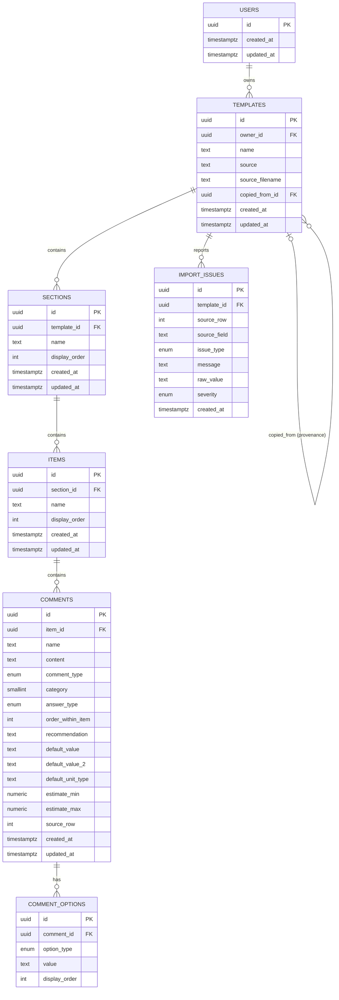

# Schema and Domain Design — Hive Inspect Template Importer

Status: **design only**. This document specifies *what* we model and *why*. The exact
queries/migration SQL are intentionally deferred and will be written in the next pass.
A draft exists at `database/migrations/0001_create_template_schema.sql` (kept aside for
reference), plus `database/seed/dev_auth.sql` for the development identity.

## 1. Goal

The app imports a Spectora *HTML-text* spreadsheet export into a **structured, editable**
model. The design must:

- preserve the template's text, hierarchy, and ordering;
- make skipped/unsupported content **visible** instead of silently dropping it;
- allow editing and **independent copies** that never share child records;
- keep every template owned by exactly one authenticated user;
- persist in PostgreSQL (Supabase) as the source of truth — no browser storage.

## 2. Source export (what we analyzed)

Committed file: `sample-data/sheet1.xml` — Spectora › Export to spreadsheet › HTML Text
(InterNACHI Residential template). Structure: one worksheet, `A1:AP393` = 1 header row +
392 data rows, 42 columns.

Each row is **one comment**, grouped under a section and an item:

```
Section (col A)  →  Item (col B)  →  Comment (cols C–L...)
```

- 13 sections; each section appears in first-seen order per column A.
- ~72 items; item order = order of first appearance within its section (column B).
- 392 comments; **comment order within an item** is explicit in column J
  (`Order (w/i item)` — values 0..12). This is why ordering is never inferred from
  insertion: a later spreadsheet row can hold an earlier comment order.
- `Comment Text` (col D) may contain **HTML at the comment level** (`<p>`, `<a href>`,
  `xml:space="preserve"`), XML-escaped in the file. The template itself is never one
  opaque HTML blob.
- 83 comments have empty comment text (typical "probe/checkbox" comments with options).

### Field mapping (decided)

| Export column | Modeled as | Notes |
| --- | --- | --- |
| A Section Name | `sections.name` | + `sections.display_order` (first-seen order) |
| B Item Name | `items.name` | + `items.display_order` |
| C Comment Name | `comments.name` | required |
| D Comment Text | `comments.content` (text) | HTML allowed here only |
| E Comment Type | `comments.comment_type` | enum `info/limit/defect` |
| F Category | `comments.category` | `-1 Low / 0 Med / 1 High`, nullable |
| G Multiple Choice Options | `comment_options` | `option_type = multiple_choice`, one row per value, split on comma |
| H Unit Type Options | `comment_options` | `option_type = unit_type` |
| I Recommendation | `comments.recommendation` | kept as text |
| J Order (w/i item) | `comments.order_within_item` | **explicit ordering** |
| K Answer Type | `comments.answer_type` | enum `boolean/checkbox/date/number/range/text` |
| L Default Value | `comments.default_value` | kept as text |
| M Default Value 2 | `comments.default_value_2` | for `range`; nullable |
| N Default Unit Type | `comments.default_unit_type` | for `number`/`range`; nullable |
| P/Q Default Estimate Min/Max | `comments.estimate_min/max` | nullable numeric |
| AP Last Modified, U Uses, R/S/T flags, V–i Default Photos 1–10, O Default Location | **not modeled** | empty/constant/internal in every export → surfaced as `UNSUPPORTED_CONTENT` if ever populated (e.g. a future export with a default photo) |
| (implicit spreadsheet row) | `comments.source_row`, `import_issues.source_row` | provenance for preservation checks & issue correlation |

Rationale: only columns that carry template content used for import fidelity, the editing
workflow, or preservation checks become first-class columns. Empty/constant bookkeeping
("Uses", "Last Modified", export-time flags) is deliberately omitted instead of cluttering
the model.

## 3. Entities and relationships

```
User
 │
 ▼
Template
 │
 ├── Section
 │     └── Item
 │           └── Comment
 │                 └── CommentOption
 │
 └── ImportIssue
```



## 4. Table design notes

- **users** — identity reference only (`id` = Supabase Auth user id). In production a
  trigger mirrors `auth.users` into `public.users`; locally a deterministic dev user is
  seeded. No separate auth system.
- **templates** — one complete inspection template. `owner_id` required. `source`
  identifies the importer (e.g. `spectora`); `source_filename` keeps the original upload
  name. `copied_from_id` is nullable **provenance only** — it never shares child rows.
- **sections / items** — one parent, explicit `display_order`. The UNIQUE
  `(parent_id, display_order)` constraint prevents ambiguous ordering.
- **comments** — one parent (item). `content` is `TEXT` (HTML-per-comment allowed) and is
  never a whole-template blob. `category`, estimate, and recommendation fields are
  nullable. `source_row` keeps the spreadsheet row for preservation checks.
- **comment_options** — one normalized table, discriminated by `option_type`
  (`multiple_choice | unit_type`). Covers both comma-separated option columns without
  extra tables. Preserves the source value ordering via `display_order`.
- **import_issues** — persistent, user-visible import diagnostics. **Not** a general
  logging table. See §7.

## 5. Constraints and deletion behavior

Reviewed per relationship (no blind cascade):

| Relationship | Required | On delete of parent |
| --- | --- | --- |
| `templates.owner_id → users` | yes | **CASCADE** (user's templates die with the user) |
| `sections.template_id → templates` | yes | **CASCADE** (no meaning outside its template) |
| `items.section_id → sections` | yes | **CASCADE** |
| `comments.item_id → items` | yes | **CASCADE** |
| `comment_options.comment_id → comments` | yes | **CASCADE** |
| `import_issues.template_id → templates` | yes | **CASCADE** (issues belong to one import) |
| `templates.copied_from_id → templates` | no | **SET NULL** (deleting an original must not break its copies) |

Other constraints: NOT NULL on required fields; `category` in (-1,0,1); non-negative
order/display_order values; UNIQUE ordering per parent; enum-typed columns constrained.

## 6. Indexes

Minimal and purposeful:

- `templates(owner_id)` — list-by-user queries (FK does not auto-index).
- `comments(item_id, order_within_item)` — ordered children reads.
- `import_issues(template_id)` — issue listing per import.

`sections(template_id, display_order)` and `items(section_id, display_order)` need no
extra indexes: their UNIQUE constraints already create those BTrees; `comment_options`
is covered by its own UNIQUE constraint.

## 7. Import issue semantics (do not conflate)

- `SOURCE_DATA_MISSING` — the information was **not present** in the export
  (e.g. a section/item/comment with no text).
- `UNSUPPORTED_CONTENT` — the information **existed** in the export but we could not
  fully represent it (e.g. a future export carrying Default Photo or Default Location
  values, or markup we strip).
- `INVALID_SOURCE_DATA` — malformed source data (acceptable third category).

Each issue records `template_id`, optional `source_row` / `source_field`, `message`,
raw value, and a severity (`info | warning | error`).

## 8. Authentication design

Boundary (implementation-agnostic):

```
Authentication Provider
        ↓
Authentication Protocol   (AuthenticationProvider → get_current_user() → UserContext)
        ↓
Application User Context  (UserContext: user_id, provider)
        ↓
Application Services
```

- **Production:** Supabase Auth → `SupabaseAuthProvider` resolves the authenticated user
  id into the same `UserContext`. (Not implemented yet; fails closed.)
- **Development:** `DevAuthProvider` — explicitly dev-only, deterministic user id
  `00000000-0000-0000-0000-000000000001`, matches the seeded dev user, lets the backend
  run fully offline. The factory wires it only for non-production environments, and no
  code path can enable it in production.
- Both providers satisfy the same `AuthenticationProvider` protocol and return the same
  `UserContext`, so application/domain code never depends on Supabase specifics.

## 9. Row Level Security / authorization

- **Primary enforcement — application layer.** The backend uses a privileged DB role and
  scopes every query to `owner_id = current user`.
- **Defense in depth — RLS.** Where Supabase Auth exists, RLS is enabled with policies
  keyed on `auth.uid()` for every table (users self; templates by `owner_id`; children via
  owner-through-FK `EXISTS` checks). This guards any direct user-scoped access.
- RLS statements are guarded to apply only when the `auth` schema is present, so the
  migration also runs on plain local PostgreSQL and CI.
- The frontend is **never** given unrestricted database access.

## 10. Copies (independent duplication)

Duplicating template A produces template B with brand-new ids for template, sections,
items, comments, options, and (optionally) issues. All foreign keys point at B's new
records. Editing B can never mutate A. `copied_from_id` on B is provenance only. No shared
mutable children, no version-control machinery.

## 11. Domain model & protocol boundaries (intended)

Persistence-agnostic domain types (no FastAPI/SQLAlchemy/Supabase/XLSX imports):

- `UserContext` (+ provider kind)
- `Template` → `Section` → `Item` → `Comment` → `CommentOption`
- `ImportIssue`
- Enums mirroring the DB: `CommentType`, `AnswerType`, `OptionType`, `IssueType`,
  `IssueSeverity`

Protocols (conceptual signatures; final signatures tuned when implemented):

- `AuthenticationProvider.get_current_user() -> UserContext`
- `TemplateRepository`: `create`, `get`, `list_for_user`, `update`, `duplicate`
- `ImportIssueRepository`: `create`, `list_for_template`
- `TemplateImporter` (existing boundary) returns a structured `Template`

Flow: API → Application → Protocols/Domain → Adapters → Infrastructure.

## 12. Seed strategy

One minimal development identity seeded via `database/seed/dev_auth.sql`
(the deterministic dev user). **No** hundreds of fake template records — the real Spectora
template is imported by the importer in the next phase.

## 13. Deliberately not in this step

- The Spectora importer, import/edit/duplicate APIs, and UI.
- Full Supabase Auth implementation (provider adapter slot exists but unimplemented).
- SQLAlchemy/ORM persistence layer, AI, reporting, scheduling, payments, portals.
- Exact migration SQL/seed queries (drafted aside, to be finalized together).